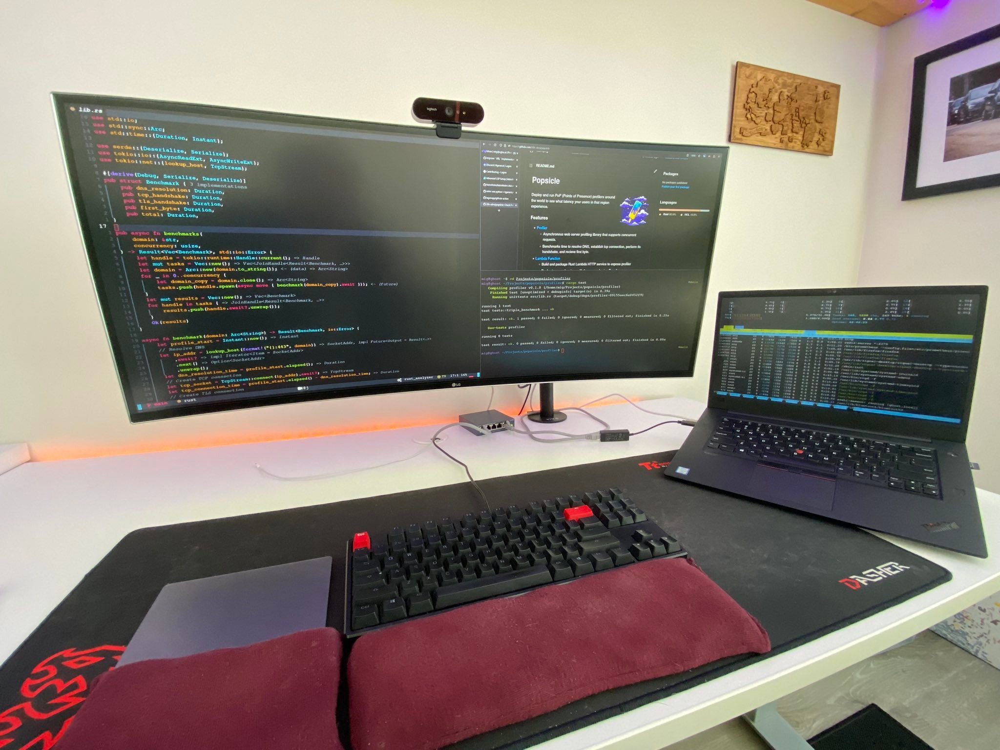

# dotfiles




> LG 38WK95C, Ducky One, Apple Magic Trackpad (it works with Linux!), Thinkpad X1E

## Prerequisites

When installing with the archinstall tool, use the following settings:

    - Bootloader: Systemd-boot
    - User Account: add one! make it have sudo
    - Audio: Pipewire
    - kernels: linux-zen
    - Network configuration: Use NetworkManager
    - Optional Repos: multilib

Once you are logged in as your newly created privileged user, install git:

```
sudo pacman -Syu git
```

Finally, this repo uses [Paru](https://github.com/Morganamilo/paru) for installing AUR packages. Follow the Paru repo for [installation](https://github.com/Morganamilo/paru#installation).

## GPU Setup

I did not automate this part. Follow https://github.com/korvahannu/arch-nvidia-drivers-installation-guide to setup 4080 (since that's what I have), otherwise, manually get your gpu drivers working. Might have to generate x11 configs after the next step to ensure x11 plays nice with gpu.

## Setup

Everything is configured within this repo which will automatically apply changes since they are symlinks! A prompt will ask you what to do if a symlink already exists.

Run the following to install all the packages and configure them:

```
git clone https://github.com/20k-ultra/dotfiles.git ~/.dotfiles
cd ~/.dotfiles
./apply.sh
```

This will go into each topic and install the packages and configure them by symlinking dotfiles or running custom configure scripts. See [Structure](#structure) for more info.

## Structure

Each folder is a **topic** with several special files that will be processed differently when the apply script runs.

The apply.sh script just iterates over the topics and installs their packages via paru and then symlinks files into your $HOME directory. See [Special file types](#special-file-types) for more. Additional install/configure overrides can be seen at [Special execution files](#special-execution-files) if the topic requires more then just symlinking!

> NOTE: Files in topics that end with \*.zsh are sourced in zsh/zsh.symlink. The installer will not symlink `.zsh` files.

### Special topics:

- **bin/**: Anything in bin/ will get added to your $PATH and be made available everywhere.
- **profile/**: User profile configurations such as additional $PATH values, ENV vars, aliases, and functions.
- **system/**: System wide configurations that are installed with root.

### Special execution files:

- **topic/config.sh**: Any file named config.sh within a topic will be executed after any files matching \*.symlinks are symlinked.
- **topic/install.sh**: Any file named install.sh within a topic will be executed when you run apply.sh instead of just passing a topicPkg.list to paru.

### Special file types:

- **topic/\*.zsh**: Any files ending in .zsh get loaded into your environment.
- **topic/path.zsh**: Any file named path.zsh is loaded first and is expected to setup $PATH or similar.
- **topic/completion.zsh**: Any file named completion.zsh is loaded last and is expected to setup autocomplete.
- **topic/topicPkg.list**: Contains all the packages related to the topic. Can be a single package.
- **topic/\*.symlink**: Any file ending in \*.symlink gets symlinked into your $HOME. This is so you can keep all of those versioned in your dotfiles but still keep those autoloaded files in your home directory. These get symlinked in when you run apply.sh.

## Design Inspiration

Repo is inspired by https://github.com/holman/dotfiles approach to dotfile management by separating software into topics and defining common interfaces to installing and configuring them.
